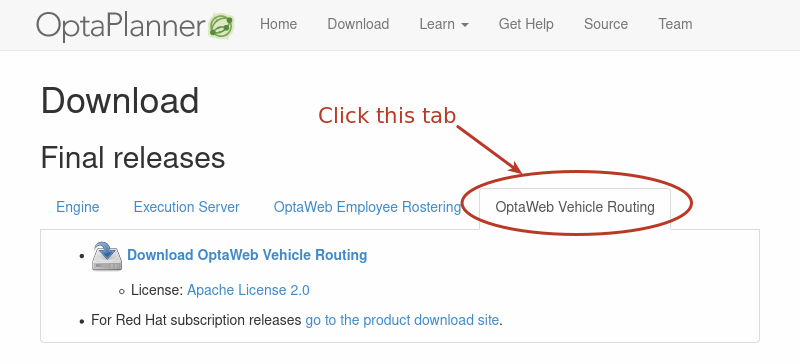
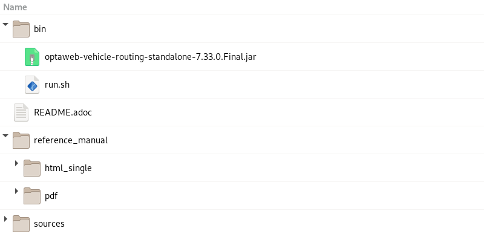
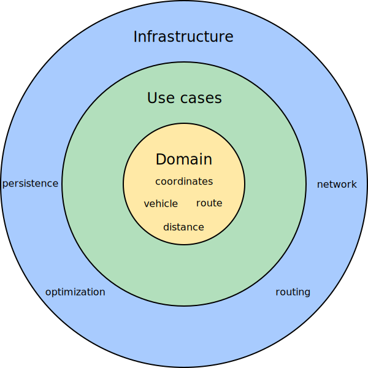

= Using OptaWeb Vehicle Routing
The OptaPlanner Team <https://www.optaplanner.org/community/team.html>
:doctype: book
:experimental:
:icons: font
:sectanchors:
:sectlinks:
:sectnums:
:toc: left
:toclevels: 3

[.normal]

include::attributes_comm.adoc[]

:COMMUNITY:

ifdef::COMMUNITY[]
As a developer, you can use OptaWeb Vehicle Routing to optimize your vehicle fleet deliveries.
In this guide, you will create and run a sample OptaWeb Vehicle Routing application.
endif::COMMUNITY[]

ifdef::PRODUCTIZED[]
As a developer, you can use the OptaWeb Vehicle Routing starter application to optimize your vehicle fleet deliveries.

.Prerequisites

* OpenJDK (JDK) {VRP-JDK-VERSION} is installed. Red Hat build of Open JDK is available from the https://access.redhat.com/jbossnetwork/restricted/listSoftware.html[Software Downloads] page in the Red Hat Customer Portal (login required).
* Apache Maven {VRP-MAVEN-VERSION} or higher is installed. Maven is available from the https://maven.apache.org/[Apache Maven Project] website.
endif::PRODUCTIZED[]

== What is OptaWeb Vehicle Routing?
//We try to avoid empty headings where you have a heading followed directly by a sub-heading so I promoted this section and removed Introduction.

The main purpose of many businesses is to transport various types of cargo.
The goal of these businesses is to deliver a piece of cargo from the loading point to a destination and use its vehicle fleet in the most efficient way. One of the main objectives is to minimize travel costs which are measured in either time or distance.

//ifdef::COMMUNITY[]
//This type of optimization problem is referred to as the https://www.optaplanner.org/learn/useCases/vehicleRoutingProblem.html[vehicle routing problem] (VRP) and has many variations.
//endif::COMMUNITY[]

This type of optimization problem is referred to as the vehicle routing problem (VRP) and has many variations.

//ifdef::COMMUNITY[]
//https://www.optaplanner.org/[OptaPlanner]
//endif::COMMUNITY[]

{PLANNER} can solve many of these vehicle routing variations and provides solution examples.
{PLANNER} enables developers to focus on modeling business rules and requirements instead of learning https://en.wikipedia.org/wiki/Constraint_programming[constraint programming] theory.
OptaWeb Vehicle Routing expands the vehicle routing capabilities of {PLANNER} by providing a reference implementation that answers questions such as these:

* Where do I get the distances and travel times?
* How do I visualize the solution on a map?
* How do I build an application that runs in the cloud?

OptaWeb Vehicle Routing uses OpenStreetMap (OSM) data files. For information about OpenStreetMap, see the https://wiki.openstreetmap.org/wiki/About_OpenStreetMap[OpenStreetMap] web site.

Use the following definitions when working with OptaWeb Vehicle Routing:

*Region*:  An arbitrary area on the map of Earth, represented by an OSM file. A region can be a country, a city, a continent, or a group of countries that are frequently used together. For example, the DACH region includes Germany (DE), Austria (AT), and Switzerland (CH).

*Country code*: A two-letter code assigned to a country by the ISO-3166 standard. You can use a country code to filter geosearch results. Because you can work with a region that spans multiple countries (for example, the DACH region), OptaWeb Vehicle Routing accepts a list of country codes so that geosearch filtering can be used with such regions. For a list of country codes, see https://www.iso.org/iso-3166-country-codes.html[_ISO 3166 Country Codes_]

*Geosearch*: A type of query where you provide an address or a place name of a region as the search keyword and receive a number of GPS locations as a result. The number of locations returned depends on how unique the search keyword is. Because most place names are not unique, filter out nonrelevant results by including only places in the country or countries that are in your working region.

////
You can get up and running with OptaWeb Vehicle Routing in just a few steps.
In this chapter you will download the OptaWeb Vehicle Routing distribution archive containing a binary build of OptaWeb Vehicle Routing.
You will then use a Bash script to run the binary without having to build the project.
////

ifdef::COMMUNITY[]
//ifdef::COMMUNITY[]
//[[install-java]]
//endif::COMMUNITY[]

== Install Java 8 or higher

Java SE 8 or higher must be installed on your system before you can use OptaWeb Vehicle Routing.

NOTE: It is recommended that you install Java SE Development Kit (JDK) because it is necessary in order to build OptaWeb Vehicle Routing from the source.
However, if you have a binary distribution of OptaWeb Vehicle Routing, you only need the Java SE Runtime Environment (JRE).

.Procedure
. To check the current Java installation, enter the following command:
+
[source,shell]
----
java -version
----

. If necessary, install OpenJDK 8.
* To install OpenJDK 8 on Fedora, enter the following command:
+
[source,shell]
----
sudo dnf install java-1.8.0-openjdk-devel
----

* To install OpenJDK on other platforms, follow instructions at https://openjdk.java.net/install/.

== Download the distribution archive

To quickly evaluate OptaWeb Vehicle Routing without having to set up build tools, download the OptaWeb Vehicle Routing distribution archive, available from the {PLANNER} website.

NOTE: If you want to modify OptaWeb Vehicle Routing and build it yourself or contribute to upstream, see <<development-guide#development-guide>>.

.Procedure
. Go to https://www.optaplanner.org/download/download.html
and click the *OptaWeb Vehicle Routing* tab.
. Click *Download OptaWeb Vehicle Routing {MAVEN_ARTIFACT_VERSION}*.
+
.{PLANNER} download page

+
. Extract the downloaded distribution ZIP file.
The archive contains source files and a binary build of OptaWeb Vehicle Routing as well as the OptaWeb Vehicle Routing documentation.
+
.Content of the OptaWeb Vehicle Routing distribution archive

// I think I'll create a separate module for this for product because it's so different.

endif::COMMUNITY[]

ifdef::PRODUCTIZED[]
== Download and build the OptaWeb Vehicle Routing deployment files

You must download and prepare the deployment files before building and deploying OptaWeb Vehicle Routing.

.Procedure
. Navigate to the https://access.redhat.com/jbossnetwork/restricted/listSoftware.html[Software Downloads] page in the Red Hat Customer Portal (login required), and select the product and version from the drop-down options:

* Product: {PRODUCT}
* Version: {PRODUCT_VERSION}
. Download *{PRODUCT} {PRODUCT_VERSION} Reference Implementations* (`{PRODUCT_FILE}-reference-implementation.zip`).
. Download *{PRODUCT} {PRODUCT_VERSION} Maven Repository* (`{PRODUCT_FILE}-maven-repository.zip`).
. Extract the `{PRODUCT_FILE}-maven-repository.zip` file.
. Copy the contents of the `{PRODUCT_FILE}-maven-repository/maven-repository` subdirectory into the `~/.m2/repository` directory.
. Extract the `{PRODUCT_FILE}-reference-implementation.zip` file. This archive contains three reference implementation ZIP files.
. Extract the `{PRODUCT_INIT}-{PRODUCT_VERSION_LONG}-optaweb-vehicle-routing.zip` file.
. Navigate to the `{URL_COMPONENT_VRP}-distribution-{MAVEN_ARTIFACT_VERSION}/sources` directory.
. Enter the following command to build OptaWeb Vehicle Routing:
+
[source]
----
mvn clean package -DskipTests
----

endif::PRODUCTIZED[]

== Run OptaWeb Vehicle Routing locally using the runLocally.sh script
Linux users can use the `runLocally.sh` Bash script to run OptaWeb Vehicle Routing.

NOTE: The `runLocally.sh` script does not run on macOS. If you cannot use the `runLocally.sh` script, see xref:run-vrp-manually-proc_{context}[].

The `runLocally.sh` script automates the following setup steps that otherwise must be carried out manually:

* Create the data directory.
* Download selected OpenStreetMap (OSM) files from Geofabrik.
* Try to associate a country code with each downloaded OSM file automatically.
* Build the project if the standalone JAR file does not exist.
* Launch OptaWeb Vehicle Routing by taking a single region argument or by selecting the region interactively.

See the following sections for instructions about executing the `runLocally.sh` script:

* xref:run-locally-qs-proc_{context}[]
* xref:run-locally-interactive-proc_{context}[]
* xref:run-locally-noninteractive-proc_{context}[]
* xref:run-locally-airdistance-proc_{context}[]

=== Run the OptaWeb Vehicle Routing runLocally.sh script in quick start mode

The easiest way to get started with OptaWeb Vehicle Routing is to run the `runLocally.sh` script without any arguments.

.Prerequisites
ifdef::PRODUCTIZED[]
* OptaWeb Vehicle Routing has been successfully built with Maven as described in xref:download-ref-imp-proc_{context}[].endif::PRODUCTIZED[]
endif::PRODUCTIZED[]
* Internet access is available.

.Procedure
ifdef::PRODUCTIZED[]
. Enter the following command in the `{URL_COMPONENT_VRP}-distribution-{MAVEN_ARTIFACT_VERSION}/sources` directory.
endif::PRODUCTIZED[]
ifdef::COMMUNITY[]
. Enter the following command in the project root directory.
endif::COMMUNITY[]
+
[source]
----
 ./runLocally.sh
----
 . If prompted to create the `.optaweb-vehicle-routing` directory, enter `y`. You are prompted to create this directory the first time you run the script.
 . If prompted to download an OSM file, enter `y`. The first time that you run the script, OptaWeb Vehicle Routing downloads the Belgium OSM file.
+
The application starts after the OSM file is downloaded.
. To open the OptaWeb Vehicle Routing user interface, enter the following URL in a web browser:
+
[source]
----
http://localhost:8080
----

NOTE: The first time that you run the script, it will take  a few minutes to start because the OSM file must be imported by GraphHopper and stored as a road network graph.
The next time you run the `runlocally.sh` script, load times will be significantly faster.

//.Next steps
//xref:use-vrp-con_{context}[]

=== Run the OptaWeb Vehicle Routing runLocally.sh script in interactive mode

Use interactive mode to see the list of downloaded OSM files and country codes assigned to each region.
You can use the interactive mode to download additional OSM files from Geofabrik without visiting the website and choosing a destination for the download.

.Prerequisites
ifdef::PRODUCTIZED[]
* OptaWeb Vehicle Routing has been successfully built with Maven as described in xref:download-ref-imp-proc_{context}[].endif::PRODUCTIZED[]
endif::PRODUCTIZED[]
* Internet access is available.

.Procedure
ifdef::PRODUCTIZED[]
. Change directory to `{URL_COMPONENT_VRP}-distribution-{MAVEN_ARTIFACT_VERSION}/sources`.
endif::PRODUCTIZED[]
ifdef::COMMUNITY[]
. Change directory to project root directory.
endif::COMMUNITY[]

. Enter the following command to run the script in interactive mode:
+
[source]
----
./runLocally.sh -i
----
. At the `Your choice` prompt, enter `d` to display the download menu. A list of previously downloaded regions appears followed by a list of regions that you can download.
. Optional: Select a region from the list of previously downloaded regions:
.. Enter the number associated with a region in the list of downloaded regions.
.. Press the Enter key.
. Optional: Download a region:
.. Enter the number associated with the region that you want to download. For example, to select the map of Europe, enter `5`.
.. To download the map, enter `d` then press the Enter key.
.. To download a specific region within the map, enter `e` then enter the number associated with the region that you want to download, and press the Enter key.
+

[WARNING]
.Using large OSM files
====
For the best user experience, use smaller regions such as individual European or US states.
Using OSM files larger than 1 GB will require significant RAM size and take a lot of time (up to several hours) for the initial processing.
====
+
The application starts after the OSM file is downloaded.

. To open the OptaWeb Vehicle Routing user interface, enter the following URL in a web browser:
+
[source]
----
http://localhost:8080
----

//.Next steps
//xref:use-vrp-con_{context}[]

=== Run the OptaWeb Vehicle Routing runLocally.sh script in non-interactive mode

Use OptaWeb Vehicle Routing in non-interactive mode to start OptaWeb Vehicle Routing with a single command that includes an OSM file that you downloaded previously.
This is useful when you want to switch between regions quickly or when doing a demo.

.Prerequisites
ifdef::PRODUCTIZED[]
* OptaWeb Vehicle Routing has been successfully built with Maven as described in xref:download-ref-imp-proc_{context}[].endif::PRODUCTIZED[]
endif::PRODUCTIZED[]
* The OSM file for the region that you want to use has been downloaded. For information about downloading OSM files, see xref:run-locally-interactive-proc_{context}[].
* Internet access is available.

.Procedure
ifdef::PRODUCTIZED[]
. Change directory to `{URL_COMPONENT_VRP}-distribution-{MAVEN_ARTIFACT_VERSION}/sources`.
endif::PRODUCTIZED[]
ifdef::COMMUNITY[]
. Change to the project root directory.
endif::COMMUNITY[]

. Execute the following command where `<OSM_FILE_NAME>` is an OSM file that you downloaded previously:
+
[source]
----
./runLocally.sh <OSM_FILE_NAME>
----

//.Next steps
//xref:use-vrp-con_{context}[]

=== Run the OptaWeb Vehicle Routing runLocally.sh script in air distance mode

OptaWeb Vehicle Routing can work in air distance mode that calculates travel times based on the distance between two coordinates.
Use this mode in situations where you need to get OptaWeb Vehicle Routing up and running as quickly as possible and do not want to use an OSM (OpenStreetMap) file.
Air distance mode is only useful if you need to smoke-test OptaWeb Vehicle Routing and you do not need accurate travel times.

.Prerequisites
ifdef::PRODUCTIZED[]
* OptaWeb Vehicle Routing has been successfully built with Maven as described in xref:download-ref-imp-proc_{context}[].endif::PRODUCTIZED[]
endif::PRODUCTIZED[]
* Internet access is available.

.Procedure
ifdef::PRODUCTIZED[]
. Change directory to `{URL_COMPONENT_VRP}-distribution-{MAVEN_ARTIFACT_VERSION}/sources`.
endif::PRODUCTIZED[]
ifdef::COMMUNITY[]
. Change to the project root directory.
endif::COMMUNITY[]
. Run the `runLocally.sh` script with the `--air` argument to start OptaWeb Vehicle Routing in air distance mode:
+
[source,bash]
----
./runLocally.sh --air
----

//.Next steps
//xref:use-vrp-con_{context}[]

=== Update the data directory

You can update the data directory that OptaWeb Vehicle Routing  uses if you want to use a different data directory. The default data directory is `$HOME/.optaweb-vehicle-routing`.

ifdef::PRODUCTIZED[]
.Prerequisites
* OptaWeb Vehicle Routing has been successfully built with Maven as described in xref:download-ref-imp-proc_{context}[].
endif::PRODUCTIZED[]

.Procedure
* To use a different data directory, at its absolute path to the `.DATA_DIR_LAST` file in the current data directory.
* To change country codes associated with a region, edit the corresponding file in the `country_codes` directory, in the current data directory.
+
For example, if you downloaded an OSM file for Scotland and the script fails to guess the country code, set the content of `country_codes/scotland-latest` to GB.

* To remove a region, delete the corresponding OSM file from `openstreetmap` directory in the data directory and delete the region's directory in the `graphhopper` directory.

== Configure and run OptaWeb Vehicle Routing manually

The easiest way to run OptaWeb Vehicle Routing is to use the `runlocally.sh` script. However, if Bash is not available on your system you can manually complete the steps that the `runlocally.sh` script performs.

.Prerequisites
ifdef::PRODUCTIZED[]
* OptaWeb Vehicle Routing has been successfully built with Maven as described in xref:download-ref-imp-proc_{context}[].endif::PRODUCTIZED[]
endif::PRODUCTIZED[]
* Internet access is available.

.Procedure
. Download routing data.
+
The routing engine requires geographical data to calculate the time it takes vehicles to travel between locations.
You must download and store OpenStreetMap (OSM) data files on the local file system before you run OptaWeb Vehicle Routing.
+
NOTE: The OSM data files are typically between 100 MB to 1 GB and take time to download so it is a good idea to download the files before building or starting the OptaWeb Vehicle Routing application.

.. Open `http://download.geofabrik.de/` in a web browser.
.. Click a region in the *Sub Region* list, for example *Europe*. The subregion page opens.
.. In the *Sub Regions* table, download the OSM file (`.osm.pbf`) for a country, for example Belgium.

. Create the data directory structure.
+
OptaWeb Vehicle Routing reads and writes several types of data on the file system.
It reads OSM (OpenStreetMap) files from the `openstreetmap` directory, writes a road network graph to the `graphhopper` directory, and persists user data in a directory called `db`.
Create a new directory dedicated to storing all of these data to make it easier to upgrade to a newer version of OptaWeb Vehicle Routing in the future and continue working with the data you created previously.

.. Create the `$HOME/{VRP-DATA-DIR}` directory.
.. Create the `openstreetmap` directory in the `$HOME/{VRP-DATA-DIR}` directory:
+
[source,subs="attributes+"]
----
$HOME/{VRP-DATA-DIR}
└── openstreetmap
----

.. Move all of your downloaded OSM files (files with the extension `.osm.pbf`) to the `openstreetmap` directory.
+
The rest of the directory structure is created by the OptaWeb Vehicle Routing application when it runs for the first time.
After that, your directory structure is similar to the following example:
+
[source,subs="attributes+"]
----
$HOME/{VRP-DATA-DIR}

├── db
│   └── vrp.mv.db
├── graphhopper
│   └── belgium-latest
└── openstreetmap
    └── belgium-latest.osm.pbf
----
// TODO maybe replace this with a screenshot, doesn't look good in PDF.

ifdef::PRODUCTIZED[]
. Change directory to `{URL_COMPONENT_VRP}-distribution-{MAVEN_ARTIFACT_VERSION}/sources/optaweb-vehicle-routing-standalone/target`.
endif::PRODUCTIZED[]
ifdef::COMMUNITY[]
. Change directory to the project root directory.
endif::COMMUNITY[]
. To run OptaWeb Vehicle Routing, enter the following command:
+
[source,subs="attributes+"]
----
java -jar optaweb-vehicle-routing-standalone-{MAVEN_ARTIFACT_VERSION}.jar \
--app.persistence.h2-dir=$HOME/{VRP-DATA-DIR}/db \
--app.routing.gh-dir=$HOME/{VRP-DATA-DIR}/graphhopper \
--app.routing.osm-dir=$HOME/{VRP-DATA-DIR}/openstreetmap \
--app.routing.osm-file=<OSM_FILE_NAME> \
--app.region.country-codes=<COUNTRY_CODE_LIST> \
----
In this command, replace the following variables:

* `<OSM_FILE_NAME>`: The OSM file for the region that you want to use and that you downloaded previously
* `<COUNTRY_CODE_LIST>`: A comma-separated list of country codes used to filter geosearch queries. For a list of country codes, see https://www.iso.org/iso-3166-country-codes.html[_ISO 3166 Country Codes_].
+
The application starts after the OSM file is downloaded.
+
In the following example, OptaWeb Vehicle Routing downloads the OSM map of Central America (`central-america-latest.osm.pbf`) and searches in the countries Belize (BZ) and Guatemala (GT).
+
[source,subs="attributes+"]
----
java -jar optaweb-vehicle-routing-standalone-{MAVEN_ARTIFACT_VERSION}.jar \
--app.persistence.h2-dir=/home/user/.optaweb-vehicle-routing/db \
--app.routing.osm-dir=/home/user/.optaweb-vehicle-routing/openstreetmap \
--app.routing.gh-dir=/home/user/.optaweb-vehicle-routing/graphhopper \
--app.routing.osm-file=central-america-latest.osm.pbf \
--app.region.country-codes=BZ,GT
----

. To open the OptaWeb Vehicle Routing user interface, enter the following URL in a web browser:
+
[source]
----
http://localhost:8080
----

//.Next steps
//xref:use-vrp-con_{context}[]

== Run OptaWeb Vehicle Routing on {OPENSHIFT}

Linux users can use the `runOnOpenShift.sh` Bash script to install OptaWeb Vehicle Routing on {OPENSHIFT}.

NOTE:  The `runOnOpenShift.sh` script does not run on macOS.

//You can use Red Hat CodeReady Containers to set up a single-node OpenShift 4 cluster on your local computer. CodeReady Containers provides a minimal preconfigured OpenShift cluster for development and testing purposes. It is delivered as a Red Hat Enterprise Linux virtual machine.

.Prerequisites

* You have access to an OpenShift cluster and the OpenShift command-line interface (`oc`) has been installed. For information about {OpenShift}, see https://access.redhat.com/documentation/en-us/openshift_container_platform/4.5/html-single/installing/index[_Installing OpenShift Container Platform_].
ifdef::PRODUCTIZED[]
* OptaWeb Vehicle Routing has been successfully built with Maven as described in xref:download-ref-imp-proc_{context}[].endif::PRODUCTIZED[]
endif::PRODUCTIZED[]
* Internet access is available.

.Procedure
. Log in to or start a {OPENSHIFT} cluster.

////
.. Add the OpenShift command-line interface (`oc`) to your `$PATH`:
+
[source,shell]
----
eval $(crc oc-env)
----

.. Log in as the `developer` user:
+
[source,shell]
----
oc login -u developer -p developer https://api.crc.testing:6443
----
////
.. Enter the following command where `<PROJECT_NAME>` is the name of your new project:
+
[source]
----
oc new-project <PROJECT_NAME>
----

ifdef::PRODUCTIZED[]
.. If necessary, change directory to `{URL_COMPONENT_VRP}-distribution-{MAVEN_ARTIFACT_VERSION}/sources`.
endif::PRODUCTIZED[]
ifdef::COMMUNITY[]
.. If necessary, change to the project root directory.
endif::COMMUNITY[]

.. Enter the following command to execute the `runOnOpenShift.sh` script and download an OpenStreetMap (OSM) file:
+
[source]
----
./runOnOpenShift.sh <OSM_FILE_NAME> <COUNTRY_CODE_LIST> <OSM_FILE_DOWNLOAD_URL>
----
+
In this command, replace the following variables:

* `<OSM_FILE_NAME>`: The name of a file downloaded from `<OSM_FILE_DOWNLOAD_URL>`.
* `<COUNTRY_CODE_LIST>`: A comma-separated list of country codes used to filter geosearch queries. For a list of country codes, see https://www.iso.org/iso-3166-country-codes.html[_ISO 3166 Country Codes_].
* `<OSM_FILE_DOWNLOAD_URL>`: The URL of an OSM data file in PBF format accessible from OpenShift. The file will be downloaded during backend startup and saved as `/deployments/local/<OSM_FILE_NAME>`.
+
The following example configures OptaWeb Vehicle Routing to filter geosearch results to Belgium and downloads the latest Belgium OSM extract from Geofabrik:
+
In the following example, OptaWeb Vehicle Routing downloads the OSM map of Central America (`central-america-latest.osm.pbf`) and searches in the countries Belize (BZ) and Guatemala (GT).
+
[source]
----
./runOnOpenShift.sh central-america-latest.osm.pbf BZ,GT http://download.geofabrik.de/europe/central-america-latest.osm.pbf
----

NOTE: For help with the `runOnOpenShift.sh` script, enter `./runOnOpenShift.sh --help`.

=== Updating the deployed OptaWeb Vehicle Routing application with local changes

After you deploy your OptaWeb Vehicle Routing application on {OPENSHIFT}, you can update the back end and front end.

.Prerequisites
* OptaWeb Vehicle Routing has been successfully built with Maven and deployed on OpenShift.

.Procedure
* To update the back end, perform the following steps:

. Change the source code and build the back end module with Maven.
ifdef::PRODUCTIZED[]
. Change directory to `{URL_COMPONENT_VRP}-distribution-{MAVEN_ARTIFACT_VERSION}/sources/optaweb-vehicle-routing-backend`.
endif::PRODUCTIZED[]
ifdef::COMMUNITY[]
. Change to the `optaweb-vehicle-routing-backend` directory.
endif::COMMUNITY[]
. Enter the following command to start the OpenShift build:
+
[source,shell]
----
oc start-build backend --from-dir=. --follow
----

* To update the front end, perform the following steps:

. Change the source code and build the front end module with the `npm` utility.
. Change directory to `sources/optaweb-vehicle-routing-frontend`.
. Enter the following command to start the OpenShift build:
+
[source,shell]
----
oc start-build frontend --from-dir=docker --follow
----

//.Next steps
//xref:use-vrp-con_{context}[]

== Using OptaWeb Vehicle Routing

In the OptaWeb Vehicle Routing application, you can mark a number of locations on the map.
The first location is assumed to be the depot.
Vehicles must deliver goods from this depot to every other location that you marked.

You can set the number of vehicles and the carrying capacity of every vehicle.
However, the route is not guaranteed to use all vehicles.
The application uses as many vehicles as required for an optimal route.

The current version has certain limitations:

* Every delivery to a location is supposed to take one point of vehicle capacity.
For example, a vehicle with a capacity of 10 can visit up to 10 locations before returning to the depot.
* Setting custom names of vehicles and locations is not supported.

=== Creating a route

To create an optimal route, use the *Demo* tab of the OptaWeb Vehicle Routing user interface.

.Prerequisites
* OptaWeb Vehicle Routing is running and you have access to the user interface.

.Procedure
. In OptaWeb Vehicle Routing, click *Demo* to open the *Demo* tab.
. Use the blue minus and plus buttons above the map to set the number of vehicles. Each vehicle has a default capacity of 10.
. Use the plus button in a square on the map to zoom in as required.
+
[NOTE]
====
Do not double-click to zoom in.
A double click also creates a location.
====
+
. Click a location for the depot.
. Click other locations on the map for delivery points.
. If you want to delete a location:
.. Hover the mouse cursor over the location to see the location name.
.. Find the location name in the list in the left part of the screen.
.. Click the *X* icon next to the name.

Every time you add or remove a location or change the number of vehicles, the application creates and displays a new optimal route.
If the solution uses several vehicles, the application shows the route for every vehicle in a different color.

=== Viewing and setting other details

You can use other tabs in OptaWeb Vehicle Routing  user interface to view and set additional details.

.Prerequisites

* OptaWeb Vehicle Routing is running and you have access to the user interface.

.Procedure

* Click  the *Vehicles* tab to view, add, and remove vehicles, and also set the capacity for every vehicle.
* Click  the  *Visits* tab to view and remove locations.
* Click  the *Route* tab to select each vehicle and view the route for the selected vehicle.

=== Creating custom data sets with OptaWeb Vehicle Routing

There is a built-in demo data set consisting of a several large Belgian cities.
If you want to have more demos available in the *Load demo* menu, you can prepare your own data sets.

.Procedure
To do that, follow these steps:

. In OptaWeb Vehicle Routing, add a depot and a number of visits by clicking on the map or using geosearch.
. Click *Export* and save the file in the data set_directory.
+
[NOTE]
====
The data set directory is the directory specified in the `app.demo.data-set-dir` property.

If the application is running through the `runLocally.sh` script, the data set directory is set to `$HOME/{VRP-DATA-DIR}/dataset`.

Otherwise, the property is from `application.properties` and defaults to `optaweb-vehicle-routing-distribution-7.39.0.Final-redhat-00001/sources/optaweb-vehicle-routing-standalone/target/local/dataset`.

You can edit the `app.demo.data-set-dir` property to specify a diffent data directory.
====
. Edit the YAML file and choose a unique name for the data set.
. Restart the back end.

After you restart the back end, files in the data set directory appear in the *Load demo* menu.

=== Troubleshooting OptaWeb Vehicle Routing

If the OptaWeb Vehicle Routing behaves unexpectedly, follow this procedure to trouble-shoot.

.Prerequisites
* OptaWeb Vehicle Routing is running and behaving unexpectedly.

.Procedure
. To identify issues, review the back end terminal output log.
. To resolve issues, remove the back end database:

.. Stop the back end by pressing kbd:[Ctrl+C] in the back end terminal window.
.. Remove the directory `optaweb-vehicle-routing/optaweb-vehicle-routing-backend/local/db`.
.. Restart OptaWeb Vehicle Routing.

== OptaWeb Vehicle Routing development guide
This section describes how to configure and run the back and front end modules in development mode.

=== OptaWeb Vehicle Routing project structure

The OptaWeb Vehicle Routing project is a multi-module Maven project.

.Module dependency tree diagram
//image::modules.dot.svg[align="center"]
image::vrp/modules.dot.svg[align="center"]

The back end and front end modules are at the bottom of the module tree. These modules contain the application source code.

The standalone module is an assembly module that combines the back end and front end into a single executable JAR file.

The distribution module represents the final assembly step.
It takes the standalone application and the documentation and wraps them in an archive that is easy to distribute.

The back end and front end are separate projects that you can build and deploy separately.
In fact, they are written in completely different languages and built with different tools.
Both projects have tools that provide a modern developer experience with fast turn-around between code changes and the running application.

The next sections describe how to run both back end and front end projects in development mode.

=== The OptaWeb Vehicle Routing back end module

////
- OptaPlanner, GraphHopper
- Spring Boot
- Configuration (`application.properties`, `application-*.properties`)
- Package structure
- DevTools
- Docker
////

The back end module contains a server-side application that uses {PLANNER} to optimize vehicle routes.
Optimization is a CPU-intensive computation that must avoid any I/O operations in order to perform to its full potential.
Because one of the chief objectives is to minimize travel cost, either time or distance, OptaWeb Vehicle Routing keeps the travel cost information in RAM memory.
While solving, {PLANNER} needs to know the travel cost between every pair of locations entered by the user.
This information is stored in a structure called the _distance matrix_.

When you enter a new location, OptaWeb Vehicle Routing calculates the travel cost between the new location and every other location that has been entered so far, and stores the travel cost in the distance matrix.
The travel cost calculation is performed by the https://github.com/graphhopper/graphhopper[GraphHopper] routing engine.

The back end module implements the following additional supporting functionality:

* Persistence
* WebSocket connection for the front end
* Data set loading, export, and import

ifdef::PRODUCTIZED[]
To learn more about the back end code architecture, see xref:backend-architecture-con_{context}[].
endif::PRODUCTIZED[]

The next sections describe how to configure and run the back end in development mode.

==== Running the OptaWeb Vehicle Routing back end module using the Spring Boot Maven plugin

You can use the Spring Boot plug-in to run the OptaWeb Vehicle Routing back end module in development mode.

.Prerequisites

* OptaWeb Vehicle Routing has been configured as described in xref:run-vrp-manually-proc_{context}[].
// TODO application-local.properties

.Procedure
ifdef::PRODUCTIZED[]
. Change directory to `{URL_COMPONENT_VRP}-distribution-{MAVEN_ARTIFACT_VERSION}/sources/optaweb-vehicle-routing-backend`.
endif::PRODUCTIZED[]
ifdef::COMMUNITY[]
. Change directory to the `optaweb-vehicle-routing-backend` directory.
endif::COMMUNITY[]

. To run the back end in development mode, enter the following command:
+
[source,shell]
----
mvn spring-boot:run
----

==== Running the OptaWeb Vehicle Routing back end module from IntelliJ IDEA
You can use the IntelliJ IDEA to run the OptaWeb Vehicle Routing back end module to make it easier to develop your project.

.Procedure

. In IntelliJ IDEA, enter  `org.optaweb.vehiclerouting.OptaWebVehicleRoutingApplication`.
This creates a run configuration that you will edit in the next step.
.. Open the `OptaWebVehicleRoutingApplication` class in the *Editor* window.
.. Click the green symbol in the editor window gutter and select *Run OptaWebVehicleRoutingApplication*. The run fails because the working directory is set to the root of the project where the back end module directory is expected.
+
// TODO remove this or change it to "if the run fails, set working directory to...", when the instructions to fill in application-local.properties are added. d.
+
NOTE: See the https://www.jetbrains.com/help/idea/running-applications.html[_Run Applications_] page on the IntelliJ IDEA web site to learn more about running applications in IntelliJ IDEA.

. Select *Run->Edit Configurations* and then select *Spring Boot->OptaWebVehicleRoutingApplication*.

. Set *Program arguments* to `--spring.profiles.active=local` to activate the Spring profile called `local`.
This directs the application to use configurations in the `application-local.properties` file.

. Change *Working directory* to the back end module (`optaweb-vehicle-routing-backend`).

. Set *On Update action* to *Hot swap classes and update trigger file if failed*.
This enables you to use the *Update* action to quickly restart the application.
+
For more information, see https://blog.jetbrains.com/idea/2018/04/spring-and-spring-boot-in-intellij-idea-2018-1/[_Spring and Spring Boot in IntelliJ IDEA 2018.1_].

==== Spring Boot automatic restart
https://docs.spring.io/spring-boot/docs/current/reference/htmlsingle/#using-boot-devtools-restart[Automatic restart]
is provided by Spring Boot DevTools. When you run the OptaWeb Vehicle Routing back end with the Spring Boot Maven plug-in, the application automatically restarts whenever files on the classpath change.
Automatic restart scans files on the classpath, so you only need to recompile your changes to trigger application restart.
No IDE configuration is needed.

If your IDE has a compile-on-save feature (for example Eclipse or NetBeans), you just need to save the files that have changed since the last compilation.

IntelliJ IDEA saves changes automatically and you need to select either *Build[Recompile]*, which recompiles the file in the active tab, or *Build[Build Project]* which recompiles all changes.
For more information, see https://www.jetbrains.com/help/idea/compiling-applications.html[Compile and build applications with IntelliJ IDEA].
[[backend-configuration]]

==== Setting OptaWeb Vehicle Routing back end module configuration properties

There are several ways that you can set OptaWeb Vehicle Routing back end module configuration properties. The methods in this section are useful if you are running OptaWeb Vehicle Routing locally.

.Prerequisites

ifdef::PRODUCTIZED[]
* The OptaWeb Vehicle Routing reference implementation has been downloaded and extracted. For information, see xref:download-ref-imp-proc_{context}[].
endif::PRODUCTIZED[]
ifdef::COMMUNITY[]
* OptaWeb Vehicle Routing has been downloaded and extracted.
endif::COMMUNITY[]

.Procedure
. Set configuration properties in the `application.properties` file:

ifdef::PRODUCTIZED[]
. Change directory to `{PRODUCT_INIT}-{MAVEN_ARTIFACT_VERSION}-optaweb-vehicle-routing/sources/optaweb-vehicle-routing-backend/src/main/resources`.
endif::PRODUCTIZED[]
ifdef::COMMUNITY[]
. Change directory to `optaweb-vehicle-routing-backend/src/main/resources`.
endif::COMMUNITY[]

. Open the `application.properties` file in a text editor.
. Edit or add properties and then save the file.

* Use a command line argument when running the packaged application. In the following example, `<PROPERTY>` is the name of a property and `<VALUE>` is the value of that property:
+
[source]
----
java -jar optaweb-vehicle-routing-backend.jar --app.<PROPERTY>=<VALUE>
----
* Use an environment variable when running the application with `spring-boot:run`:
+
[source]
----
<PROPERTY>=<VALUE> ./mvnw spring-boot:run
----
NOTE: This method requires
https://docs.spring.io/spring-boot/docs/current/reference/htmlsingle/#boot-features-external-config-relaxed-binding[relaxed binding]
which only works if the property is defined using `@ConfigurationProperties`.

It is not possible to set properties by specifying `-D` when running the application using the Spring Boot Maven plugin (`./mvnw spring-boot:run -D<PROPERTY`).
Any system properties to be set by the plugin to the forked Java process in which the application runs must
be specified in the `pom.xml` file using the `systemPropertiesVariables` attribute. For information about this attribute, see
https://docs.spring.io/spring-boot/docs/current/maven-plugin/reference/html/#run-example-system-properties[_Using System Properties_] on the Spring web site.

You can learn more about configuring a Spring Boot application on the
https://docs.spring.io/spring-boot/docs/current/reference/htmlsingle/#boot-features-external-config[Spring Boot Externalized Configuration] page.

[TIP]
Use `src/main/resources/application-local.properties` to store your personal configuration without affecting the Git working tree.

For a complete list of OptaWeb Vehicle Routing configuration properties, see xref:backend-properties-ref_{context}[].

For a complete list of application properties available in Spring Boot, see the
https://docs.spring.io/spring-boot/docs/current/reference/html/appendix-application-properties.html[_Common Application Properties_] page on the Spring web site.

==== OptaWeb Vehicle Routing backend logging

OptaWeb Vehicle Routing uses the SLF4J API and Logback as the logging framework.
The Spring environment enables you to configure most logging aspects, including levels, patterns, and log files, in the same way as other configuration properties. The most common ways to set logging properties are by editing the `application.properties` file or using arguments such as `<PROPERTY>=<VALUE>` where `<PROPERTY>` is the name of a property and `<VALUE>` is the value of that property.
See the https://docs.spring.io/spring-boot/docs/current/reference/html/spring-boot-features.html#boot-features-custom-log-levels[Spring Boot Logging]
documentation for more information.

The following examples are properties that you can use to control logging level of some parts of the application:

* `logging.level.org.optaweb.vehiclerouting=debug`:  Enables the debug level for the back end code
* `logging.level.org.optaplanner.core=warn`: Reduces {PLANNER} logging
* `logging.level.org.springframework.web.socket=trace`: Accesses more details when investigating problems with WebSocket connection

== Working with the OptaWeb Vehicle Routing front end module

////
- PatternFly, Leaflet
- Npm, React, Redux, TypeScript, ESLint, Cypress, `ncu`
- Chrome, plugins
- Docker
////

The front end project was bootstrapped with https://create-react-app.dev/[Create React App].
Create React App provides a number of scripts and dependencies that help with development and with building the application for production.

.Prerequisites
ifdef::PRODUCTIZED[]
* The OptaWeb Vehicle Routing reference implementation has been downloaded and extracted. For information, see xref:download-ref-imp-proc_{context}[].
endif::PRODUCTIZED[]
ifdef::COMMUNITY[]
* OptaWeb Vehicle Routing has been downloaded and extracted.
endif::COMMUNITY[]

.Procedure
. On Fedora, enter the following command to set up the development environment:
+
[source,shell]
----
sudo dnf install npm
----
+
See https://docs.npmjs.com/downloading-and-installing-node-js-and-npm[Downloading and installing Node.js and npm] for more information about installing npm.
ifdef::PRODUCTIZED[]
. Change directory to `{URL_COMPONENT_VRP}-distribution-{MAVEN_ARTIFACT_VERSION}/sources/optaweb-vehicle-routing-frontend`.
endif::PRODUCTIZED[]
ifdef::COMMUNITY[]
. Change to the `optaweb-vehicle-routing-frontend` directory.
endif::COMMUNITY[]
. Install `npm` dependencies:
+
[source,shell]
----
npm install
----
+
Unlike Maven, the `npm` package manager installs dependencies in `node_modules` under the project directory and does that only when you execute `npm install`.
Whenever the dependencies listed in `package.json` change, for example when you pull changes to the master branch, you must execute `npm install` before you run the development server.

. Enter the following command to run the development server:
+
[source,shell]
----
npm start
----

. If it does not open automatically, open `\http://localhost:3000/` in a web browser.
+
By default, the `npm start` command attempts to open this URL in your default browser.
+
[NOTE]
====
If you do not want the `npm start` command to open a new browser tab each time you run it, export the  `BROWSER=none` environment variable. You can use `.env.local` file to make this preference permanent.
To do that, enter the following command:

[source,shell]
----
echo BROWSER=none >> .env.local
----
====
+
The browser refreshes the page whenever you make changes in the front end source code.
The development server process running in the terminal picks up the changes as well and prints compilation and lint errors to the console.

. Enter the following command to run tests:
+
[source]
----
npm test
----

. Change the value of the `REACT_APP_BACKEND_URL` environment variable to specify the location of the back end project to be used by `npm` when you execute  `npm start` or `npm run build`, for example:
+
[source]
----
REACT_APP_BACKEND_URL=http://10.0.0.123:8081
----
+
NOTE: Environment variables are hard coded inside the JavaScript bundle during the `npm` build process, so you must specify the back end location before you build and deploy the front end.
+
To learn more about the React environment variables, see https://create-react-app.dev/docs/adding-custom-environment-variables/[_Adding Custom Environment Variables_].

. To build the front end, enter one of the following commands:
+
[source]
----
./mvnw install
----
+
[source]
----
mvn install
----

[appendix]
== Back end architecture

Domain model and use cases are essential for the application.
The OptaWeb Vehicle Routing domain model is at the center of the architecture and is surround by the application layer that embeds use cases.
Functions such as route optimization, distance calculation, persistence, and network communication are considered implementation details
and are placed at the outermost layer of the architecture.

.Diagram of application layers

//image::vrp/backend-layers.svg[align="center"]

=== Code organization

The back end code is organized in three layers, illustrated in the preceding graphic.

[literal]
....
org.optaweb.vehiclerouting
├── domain
├── plugin          # Infrastructure layer
│   ├── persistence
│   ├── planner
│   ├── routing
│   └── websocket
└── service         # Application layer
    ├── demo
    ├── distance
    ├── location
    ├── region
    ├── reload
    ├── route
    └── vehicle
....

The `service` package contains the application layer that implements use cases.
The `plugin` package contains the infrastructure layer.

Code in each layer is further organized by function.
This means that each service or plug-in has its own package.

=== Dependency rules

Compile-time dependencies are only allowed to point from outer layers towards the center.
Following this rule helps to keep the domain model independent of underlying frameworks and other implementation details and models the behavior of business entities more precisely.
With presentation and persistence being pushed out to the periphery, it is easier to test the behavior of business entities and use cases.

The domain has no dependencies.

Services only depend on the domain.
If a service needs to send a result (for example to the database or to the client), it uses an output boundary interface.
Its implementation is injected by the https://docs.spring.io/spring/docs/current/spring-framework-reference/core.html#beans[Inversion of Control] (IoC) container.

Plug-ins depend on services in two ways.
First, they invoke services based on events such as a user input or a route update coming from the optimization engine.
Services are injected into plug-ins which moves the burden of their construction and dependency resolution to the IoC container.
Second, plug-ins implement service output boundary interfaces to handle use case results, for example persisting changes to the database or sending a response to the web UI.

=== The domain package

The `domain` package contains _business objects_ that model the domain of this project, for example `Location`, `Vehicle`, `Route`.
These objects are strictly business-oriented and must not be influenced by any tools and frameworks, for example object-relational mapping tools and web service frameworks.

=== The service package

The `service` package contains classes that implement _use cases_.
A use case describes something that you want to do, for example adding a new location, changing vehicle capacity, or finding coordinates for an address.
The business rules that govern use cases are expressed using the domain objects.

Services often need to interact with plug-ins in the outer layer, such as persistence, web, and optimization.
To satisfy the dependency rules between layers, the interaction between services and plug-ins is expressed in terms of interfaces that define the dependencies of a service.
A plug-in can satisfy a dependency of a service by providing a bean that implements the boundary interface of the service.
The Spring IoC container creates an instance of the plug-in bean and injects it to the service at runtime.
This is an example of the inversion of control principle.

=== The plugin package

The `plugin` package contains infrastructure functions such as optimization, persistence, routing, and network.

[appendix]
== OptaWeb Vehicle Routing back end configuration properties
You can set the OptaWeb Vehicle Routing application properties listed in the following table.

[cols="m,d,a,d",options="header"]
|===

|Property
|Type
|Example
|Description

|`app.demo.data-set-dir`
|Relative or absolute path
|`/home/user/{VRP-DATA-DIR}/dataset`
|Custom data sets are loaded from this directory.
Defaults to `local/dataset`.

|`app.persistence.h2-dir`
|Relative or absolute path
|`/home/user/{VRP-DATA-DIR}/db`
|The directory used by H2 to store the database file.
Defaults to `local/db`.

|`app.region.country-codes`
|List of `https://en.wikipedia.org/wiki/ISO_3166-1_alpha-2[ISO 3166-1 alpha-2]` country codes
|`US`, `GB,IE`, `DE,AT,CH`, may be empty
|Restricts geosearch results.

|`app.routing.engine`
|Enumeration
|`air`, `graphhopper`
|Routing engine implementation.
Defaults to `graphhopper`.

|`app.routing.gh-dir`
|Relative or absolute path
|`/home/user/{VRP-DATA-DIR}/graphhopper`
|The directory used by GraphHopper to store road network graphs.
Defaults to `local/graphhopper`.

|`app.routing.osm-dir`
|Relative or absolute path
|`/home/user/{VRP-DATA-DIR}/openstreetmap`
|The directory that contains OSM files.
Defaults to `local/openstreetmap`.

|`app.routing.osm-file`
|File name
|`belgium-latest.osm.pbf`
|Name of the OSM file to be loaded by GraphHopper.
The file must be placed under `app.routing.osm-dir`.

|`optaplanner.solver.termination.spent-limit`
|`java.time.Duration`
|* `1m`
* `150s`
* `P2dT21h` (`PnDTnHnMn.nS`)
|How long the solver should run after a location change occurs.

|`server.address`
|IP address or hostname
|`10.0.0.123`, `my-vrp.geo-1.openshiftapps.com`
|Network address to which to bind the server.

|`server.port`
|Port number
|`4000`, `8081`
|Server HTTP port.

|===
